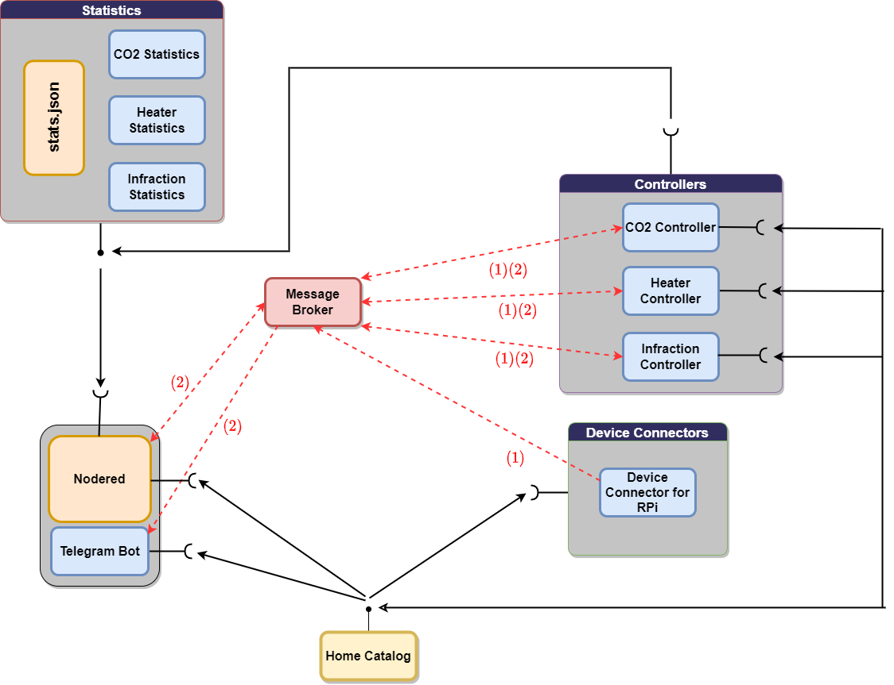

# IoT Project 

#### Members : 
- Florian Couyoupetrou
- Enzo Yacometti
- Amirabas Moghadasi
- Ewen Panheleux

## Promo and Demo Videos

- [Promo Video](https://youtu.be/d-4_AFa7-50)
- [Demo Video](https://youtu.be/ZXktv9ifZyg)

## Brief Description

The project aims at offering a smart control of three different subsystems of a smart home with the purpose of improving the inhabitants’ wellbeing, providing a security service and maintaining an adequate quality of air.

## Project Overview

The project consists in offering a smart service solution for home implementation. It integrates several IoT devices and controllers for managing different systems. It provides control strategies for heating, security and air quality systems to improve the wellbeing of inhabitants. The platform provides unified interfaces (both through the REST and MQTT paradigms) to enhance UX/UI interaction and implement the microservice paradigm for easier scalability. Finally, the platform displays through an interactive dashboard the most relevant data, gives feedback to the user and actuates correspondingly with the different subsystems according to user-defined preferences.

Summarizing, the main features it offers are:
* Personalized control of temperature
* Automatic carbon dioxide pollution regulation. 
* Personalized security system based on motion detection with incorporated Telegram messaging service.
* Unified interfaces for REST Web Services and MQTT queues
* End-user input and data visualization through a web server.

## Final Diagram

